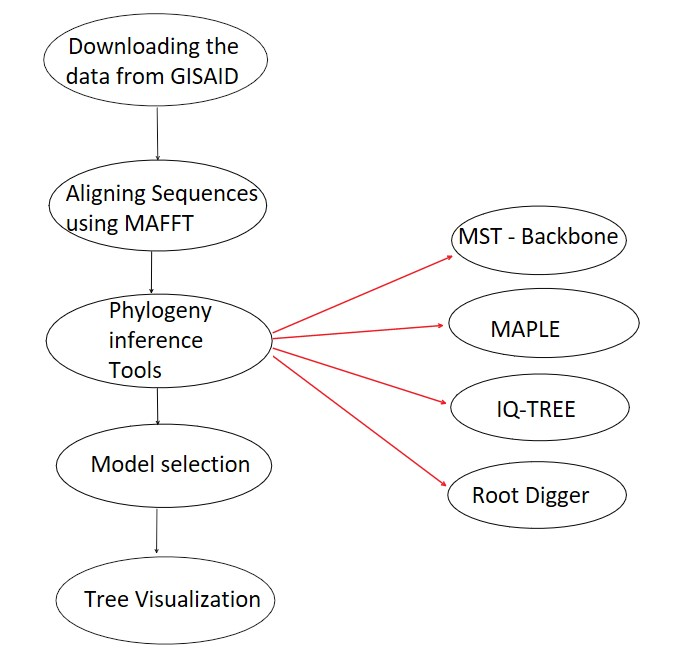

# Rooting-the-phylogenetic-trees-using-Non-Reversible-models
# Rooting Virus Phylogenies using non-reversible models


## Name
Rooting Virus Phylogenies using non-reversible models


## Description

I worked on building a rooted phylogenetic tree of specific viruses using non-reversible models with the help of phylogenetic inference approaches, mainly utilising the maximum likelihood approach to different substitution models to find the best suitable model, and performing model selection to compare different types of model to see the model that better fits for the different virus datasets. 

Custom python \& R scripts were written in order to automate the process of downloading the sequences , clean alignments, align sequences using MAFFT, run multiple tools with sequence data , compute pearson's correlation and model selection values, to visualise trees and perform miscellaneous functions; These repository contains overall automated pipelines of my thesis work.


## Download the repo
To download the repo 

```
cd existing_repo
git clone https://git.imp.fu-berlin.de/josenikhid97/rooting-virus-phylogenies-using-non-reversible-models.git

```

## Pipeline 




